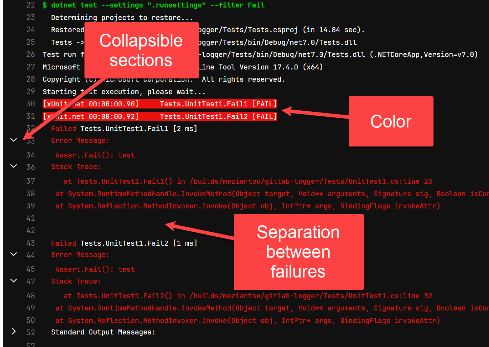

# Meziantou.GitLab.TestLogger

Test logger for `dotnet test` / `vstest`. The output is similar to the [default console logger](https://github.com/microsoft/vstest/blob/ef449ea49d874b6415c0244d775f5e3a2f4e941f/src/vstest.console/Internal/ConsoleLogger.cs) but it uses some GitLab specific features such as

- Ansi color
- Collapsible sections



# How to use it:

Add the NuGet package to your project:

````
dotnet add package Meziantou.GitLab.TestLogger
````

Add a RunSettings file with the following content:

````
<RunSettings>
  <!-- https://github.com/Microsoft/vstest-docs/blob/main/RFCs/0016-Loggers-Information-From-RunSettings.md -->
  <LoggerRunSettings>
    <Loggers>
      <!-- Disable the default console logger -->
      <Logger friendlyName="console" enabled="False" />

      <!-- Add the GitLab Logger -->
      <Logger friendlyName="gitlab">
        <Configuration>
          <verbosity>minimal</verbosity>
          <collapseStackTraces>false</collapseStackTraces>
          <collapseErrorMessages>false</collapseErrorMessages>
          <collapseStandardOutput>true</collapseStandardOutput>
          <collapseStandardError>true</collapseStandardError>
      </Configuration>
      </Logger>
    </Loggers>
  </LoggerRunSettings>
</RunSettings>
````

Run the test using `--settings`

````
dotnet test --settings "<runsettings file path>"
````